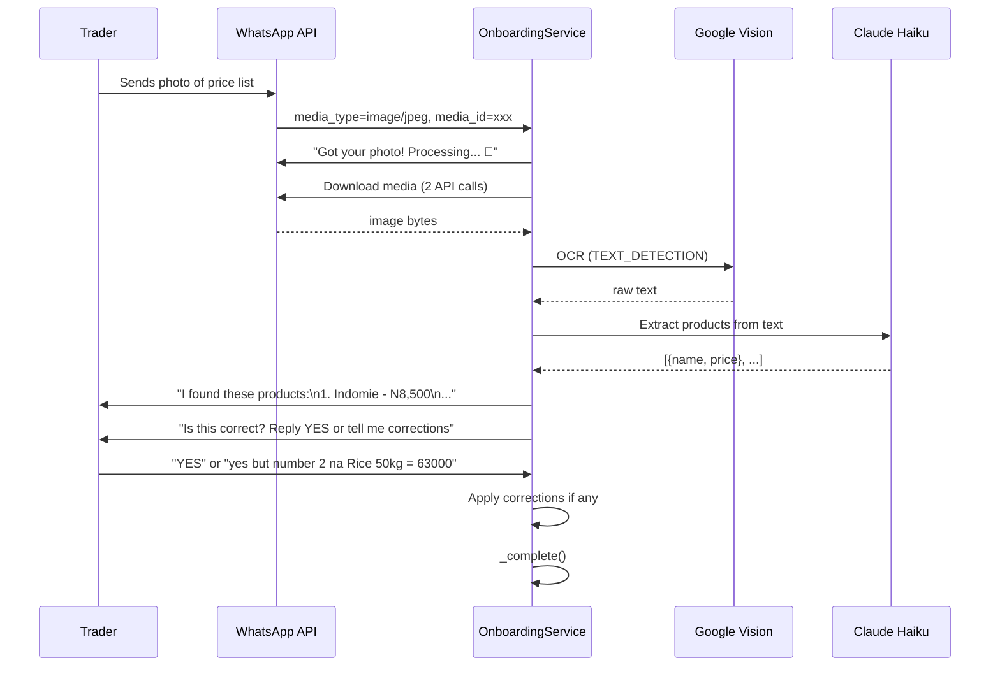
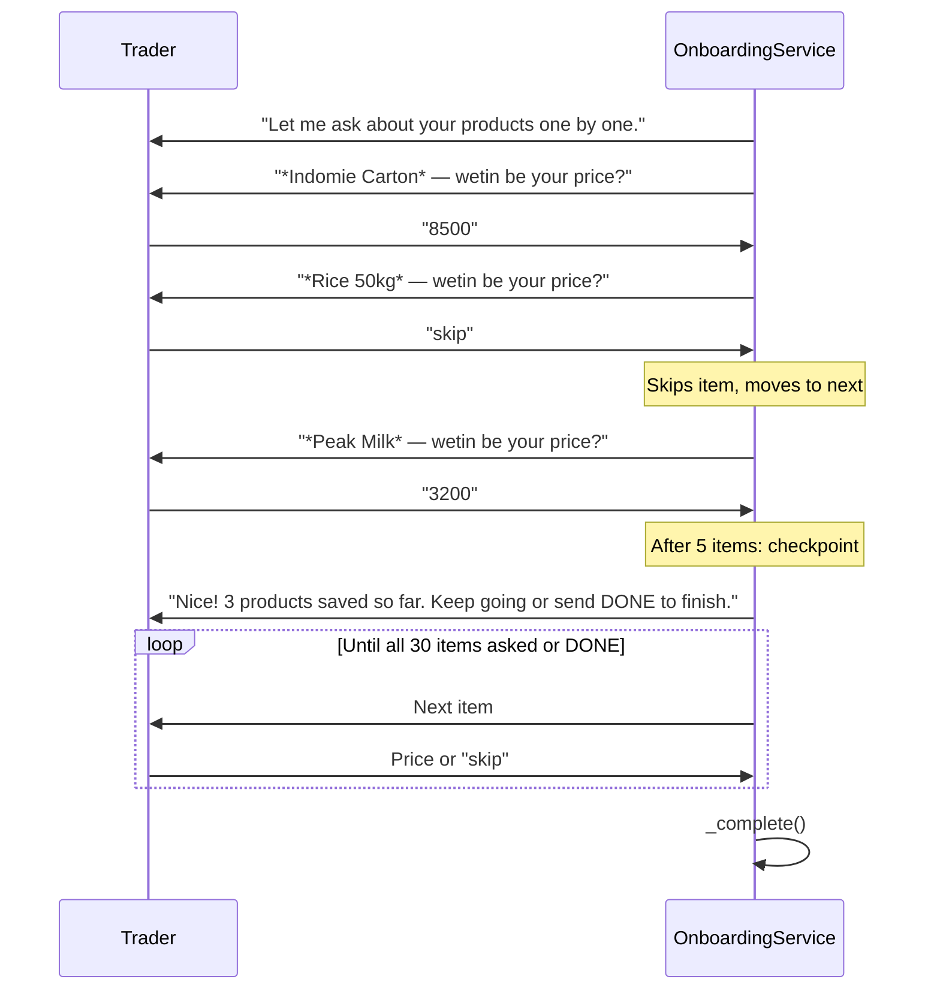
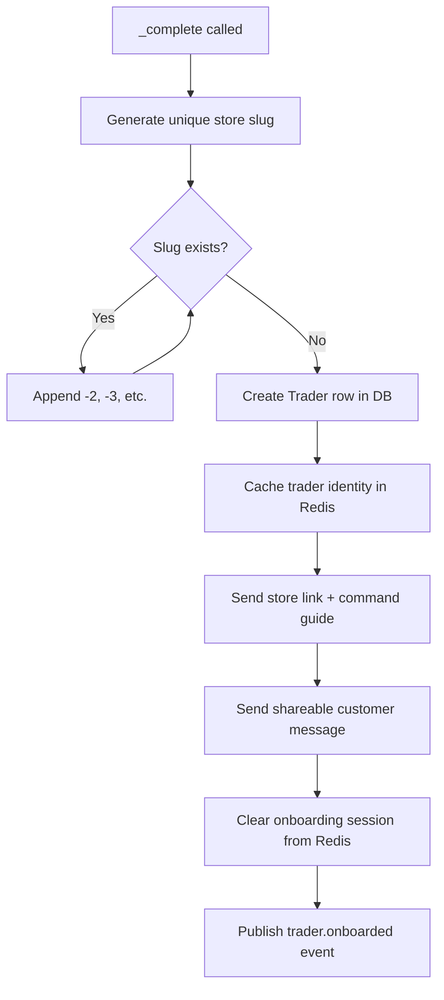
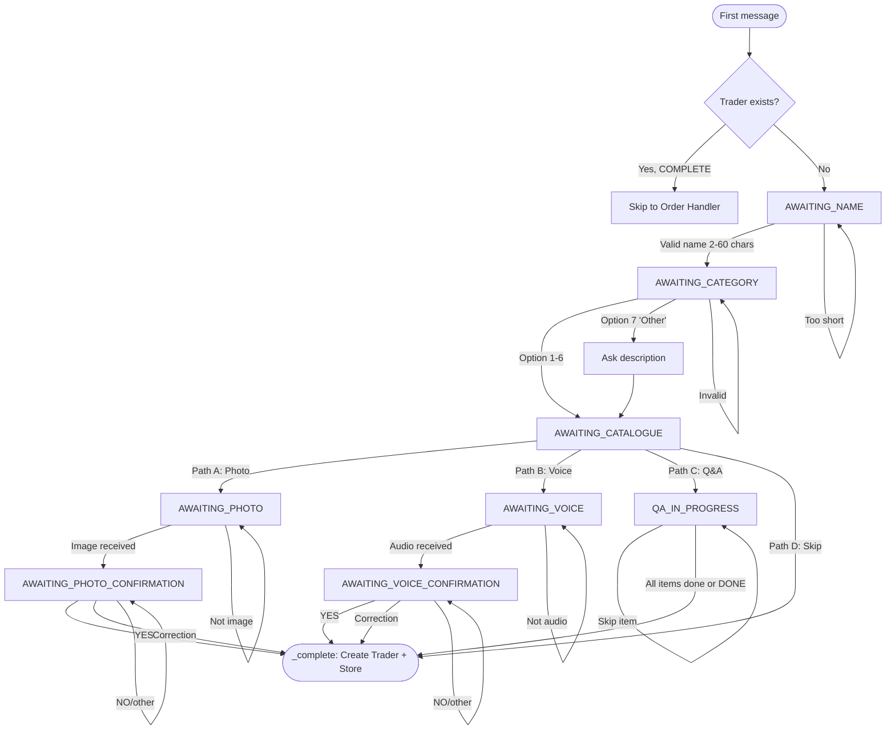
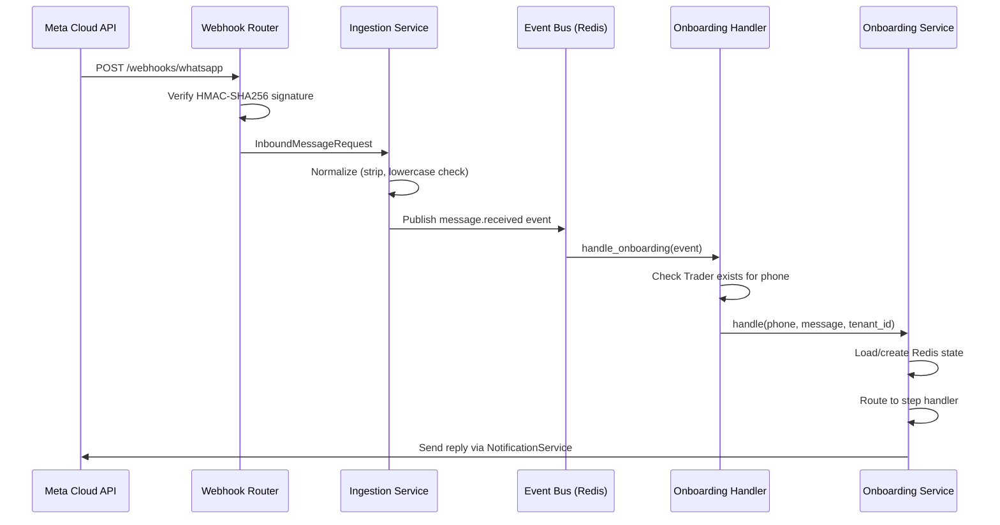

# Feature 1: Smart Trader Onboarding

## Technical Design Document

**Version:** 1.0
**Last Updated:** 2026-05-04
**Status:** Production

---

## 1. Overview

### Purpose
Smart Trader Onboarding transforms a first WhatsApp message into a fully operational store in under 3 minutes. It guides Nigerian informal market traders through setting up their business profile, product catalogue, and store link — entirely through WhatsApp conversation.

### Business Value
- Zero-friction onboarding: no apps to download, no forms to fill, no dashboards to navigate
- Meets traders where they already are: WhatsApp
- Accommodates Nigeria's digital literacy spectrum via multiple catalogue input paths
- Passively builds the store even if the trader skips catalogue setup

### Target Users
- **Primary:** Nigerian informal market traders (e.g., provisions dealers, fabric sellers, food vendors)
- **Persona:** "Mama Caro" — cracked screen phone, 2G/3G network, no time for dashboards
- **Design test (Bodija Test):** Can a fabric seller in Bodija Market use this without any instructions? If no, redesign it.

---

## 2. System Context

### Architecture Position
Onboarding is the **first feature** in the user lifecycle. It sits between the WhatsApp webhook ingestion layer and the order management system.

```
WhatsApp Cloud API
       │
       ▼
POST /webhooks/whatsapp (Ingestion Router)
       │
       ▼
  Event Bus (Redis Pub/Sub)
       │
       ├──► Onboarding Handler (this feature)
       ├──► Conversation Handler
       └──► Order Handler (skips if onboarding active)
```

### Dependencies

| Dependency | Purpose | Required |
|-----------|---------|----------|
| Meta WhatsApp Business API (v25.0) | Inbound/outbound messages, media download | Yes |
| Google Vision API | OCR for price list photos (Path A) | Path A only |
| OpenAI Whisper API | Voice note transcription (Path B) | Path B only |
| Anthropic Claude Haiku | Product extraction from OCR/transcription text | Paths A & B |
| Redis | Session state persistence, trader identity cache | Yes |
| PostgreSQL | Trader record storage | Yes |

### Key Files

| File | Responsibility |
|------|---------------|
| `app/modules/onboarding/service.py` | State machine orchestration, all business logic |
| `app/modules/onboarding/handlers.py` | Event listener, wires events to service |
| `app/modules/onboarding/session.py` | Redis state persistence |
| `app/modules/onboarding/models.py` | Trader ORM model |
| `app/modules/onboarding/repository.py` | Database operations |
| `app/modules/onboarding/catalogue_templates.py` | Pre-loaded product templates per category |
| `app/modules/onboarding/media.py` | OCR, transcription, Claude extraction, image resize |
| `app/modules/ingestion/router.py` | WhatsApp webhook entry point |

---

## 3. Entry Points

### 3.1 WhatsApp (Primary & Only Entry Point)

**Trigger:** Any first message from a phone number not associated with a completed Trader record.

**Endpoint:** `POST /api/v1/webhooks/whatsapp`

**Message Types Accepted:**
- Text messages
- Image messages (for Path A)
- Audio messages (for Path B)
- Interactive replies (button taps, list selections)

**Webhook Verification:**
- Meta sends `GET /api/v1/webhooks/whatsapp?hub.mode=subscribe&hub.verify_token=...&hub.challenge=...`
- Server returns `hub.challenge` if `hub.verify_token` matches `WHATSAPP_VERIFY_TOKEN` setting

**Signature Verification (Inbound Messages):**
- Header: `X-Hub-Signature-256: sha256=<hex>`
- Computed: `HMAC-SHA256(body, WHATSAPP_APP_SECRET)`
- Rejected with 403 if mismatch

**Meta Cloud API Payload Path:**
```
raw["entry"][0]["changes"][0]["value"]["messages"][0]
```

**Message Type Extraction:**

| WhatsApp Type | Extracted Content | Media Fields |
|--------------|-------------------|-------------|
| `text` | `msg["text"]["body"]` | None |
| `image` | `"[image]"` | `media_id=msg["image"]["id"]`, `media_type=msg["image"]["mime_type"]` |
| `audio` | `"[audio]"` | `media_id=msg["audio"]["id"]`, `media_type=msg["audio"]["mime_type"]` |
| `interactive.button_reply` | `button["id"]` | None |
| `interactive.list_reply` | `list_item["id"]` | None |

---

## 4. End-to-End Flows

### 4.1 Primary Flow (Happy Path)

```
Trader sends "Hi" → Welcome message → Ask business name
→ Trader sends "Mama Caro Provisions" → Ask category (7 options)
→ Trader sends "1" (Provisions) → Pre-load 30 items → Offer 4 catalogue paths
→ Trader chooses Path D (Skip) → Create store → Send store link + guide
```

**Total messages exchanged:** 4 inbound, 4 outbound
**Time to complete:** ~90 seconds

### 4.2 Detailed Step-by-Step

#### Step 1: First Contact Detection

**Handler:** `handle_onboarding(event: Event)` in `handlers.py`

1. Receive `message.received` event from Redis pub/sub
2. Extract `phone_number`, `content`, `tenant_id`, `media_id`, `media_type` from event payload
3. Check if sender has a completed Trader record: `repo.get_by_phone(phone_number)`
4. If Trader exists with `onboarding_status == COMPLETE` → skip (order handler will process)
5. If no Trader → proceed to `OnboardingService.handle()`

**Concurrency Guard:**
The order handler (`orders/handlers.py`) also receives the same event. To prevent both handlers from processing the message:
- Order handler checks `get_onboarding_state(sender_phone)` first
- If onboarding state exists → yields to onboarding handler
- If first message and unknown sender, order handler checks `_ONBOARDING_TRIGGERS` set and yields if matched

**Onboarding Triggers:**
```python
_ONBOARDING_TRIGGERS = {"start", "register", "join", "hi", "hello", "hey"}
```

#### Step 2: Welcome & Name Capture

**State:** `AWAITING_NAME`

**Service Method:** `_handle_name(phone_number, message, state)`

**Welcome Message (Nigerian English):**
```
Welcome to ChatToSales! 🛍️

I go help you set up your WhatsApp store. First, wetin be your business name?

E.g., "Mama Caro Provisions" or "Iya Basira Fabrics"
```

**Validation:**
- Minimum: 2 characters
- Maximum: 60 characters (truncated, not rejected)
- Empty/whitespace-only → re-prompt

**On Success:** Stores `business_name` in state data, transitions to `AWAITING_CATEGORY`

#### Step 3: Category Selection

**State:** `AWAITING_CATEGORY`

**Service Method:** `_handle_category(phone_number, message, state)`

**Category Menu:**
```
What type of business you dey run? Pick a number:

1️⃣ Provisions & Groceries
2️⃣ Fabrics & Fashion
3️⃣ Food & Drinks
4️⃣ Electronics & Gadgets
5️⃣ Cosmetics & Beauty
6️⃣ Building Materials
7️⃣ Other
```

**Category Mapping:**
```python
1 → "provisions"
2 → "fabric"
3 → "food"
4 → "electronics"
5 → "cosmetics"
6 → "building"
7 → "other"
```

**For "Other" (option 7):**
- Secondary prompt: "Describe your business in a few words (e.g., 'phone accessories')"
- Free-text response stored as category

**On Success:**
- Loads pre-built template items from `catalogue_templates.get_items(category)`
- Stores `business_category` in state data
- Transitions to `AWAITING_CATALOGUE`

#### Step 4: Catalogue Path Selection

**State:** `AWAITING_CATALOGUE`

**Service Method:** `_handle_catalogue_choice(phone_number, message, state)`

**Catalogue Menu:**
```
How you wan add your products?

1️⃣ Send photo of your price list 📸
2️⃣ Send voice note 🎤
3️⃣ I go ask you one by one ✍️
4️⃣ Skip — I go learn from your orders 🚀 (recommended)
```

**Path Routing:**
```python
"1" → AWAITING_PHOTO  (Path A: Photo OCR)
"2" → AWAITING_VOICE  (Path B: Voice)
"3" → QA_IN_PROGRESS  (Path C: Q&A)
"4" → _complete()     (Path D: Skip)
```

### 4.3 Path A: Photo/OCR Flow



**State:** `AWAITING_PHOTO` → `AWAITING_PHOTO_CONFIRMATION`

**Media Download Process:**
1. `GET https://graph.facebook.com/v25.0/{media_id}` → JSON with download URL
2. `GET {download_url}` → raw image bytes
3. Authorization: `Bearer {decrypted_access_token}` on both requests
4. Timeout: 30 seconds

**Google Vision API Call:**
```
POST https://vision.googleapis.com/v1/images:annotate?key={GOOGLE_VISION_API_KEY}
Body: {
  "requests": [{
    "image": {"content": "<base64>"},
    "features": [{"type": "TEXT_DETECTION", "maxResults": 1}]
  }]
}
```
Returns: `responses[0].textAnnotations[0].description` (full text block)

**Claude Haiku Product Extraction:**
- Model: `claude-haiku-4-5-20251001`
- Max tokens: 2048
- Prompt handles: Nigerian brand abbreviations, Pidgin English, Yoruba numbers, multiple price formats (N8500, 8,500, ₦8500, 8.5k)
- Output: JSON array `[{"name": "...", "price": 8500}, ...]`

**Failure Handling:**
- OCR returns empty text → offer fallback paths (Q&A or Skip)
- Claude extraction returns empty list → offer fallback paths
- API timeout → log error, offer fallback paths
- Never crashes the conversation — always offers an alternative

### 4.4 Path B: Voice Note Flow

**State:** `AWAITING_VOICE` → `AWAITING_VOICE_CONFIRMATION`

Identical to Path A except:
1. Audio bytes downloaded instead of image
2. Whisper transcription instead of OCR
3. Same Claude extraction pipeline on the transcription text

**OpenAI Whisper Configuration:**
```python
model = "whisper-1"
language = "en"
prompt = "Nigerian market trader listing product names and prices in Nigerian English or Pidgin English. Products include Indomie, Rice, Peak Milk, Milo, Garri. Prices are in Naira. Numbers may be spoken in Yoruba (meji=2, meta=3)."
```

**MIME Type Mapping:**
| WhatsApp MIME | File Extension |
|--------------|---------------|
| audio/ogg | .ogg |
| audio/mpeg | .mp3 |
| audio/mp4 | .mp4 |
| audio/aac | .aac |
| audio/amr | .amr |
| audio/wav | .wav |

### 4.5 Path C: Q&A Flow

**State:** `QA_IN_PROGRESS`



**Template Items per Category:** 30 items each (from `catalogue_templates.py`)

**Accepted Inputs:**
- Numeric: `8500` → 8500
- With comma: `8,500` → 8500
- With "k" suffix: `8.5k` → 8500
- Yoruba numbers: `meji` → 2 (typically for quantities, not prices)
- Skip words: `skip`, `0`, `s`, `done`, `finish`

**Price Parser (`_parse_price`):**
```python
# Step 1: Try "k" notation
match = re.search(r'(\d+(?:\.\d+)?)\s*k\b', msg)  # "8.5k" → 8500

# Step 2: Try plain digits
match = re.search(r'\d+', msg)  # "8500" → 8500
```

**Checkpoint:** Every 5 items, sends progress message with count of saved products.

**"other" Category:** Empty template list → Q&A immediately completes (nothing to ask).

### 4.6 Path D: Skip Flow

Single-step: calls `_complete()` immediately with no catalogue data. The catalogue builds passively from customer orders (Feature 3: Self-Building Product Catalogue).

### 4.7 Media Confirmation Flow (Paths A & B)

**State:** `AWAITING_PHOTO_CONFIRMATION` or `AWAITING_VOICE_CONFIRMATION`

**Accepted YES Variants:**
```python
["yes", "yeah", "y", "yep", "correct", "ok", "okay", "fine"]
```

**Correction Format:**
```
"yes but number 2 na Rice 50kg = 63000"
```

**Correction Parser (`_apply_correction`):**
- Item number: `\b(?:number|no\.?|#)?\s*(\d+)\b`
- Product name: `\bna\s+(.+?)(?:\s*[=:]\s*\d|$)` (text between "na" and price)
- Price: `[=:]\s*([\d,kK₦N.]+)` (after "=" or ":")

**On Rejection:** Re-prompts with the same product list.

### 4.8 Completion Flow

**Method:** `_complete(phone_number, state_data)`



**Slug Generation:**
```python
def _generate_unique_slug(repo, name):
    base = re.sub(r'\s+', '-', name.lower())
    base = re.sub(r'[^a-z0-9-]', '', base)
    if not base:
        base = "trader"
    slug = base
    counter = 2
    while await repo.slug_exists(slug):
        slug = f"{base}-{counter}"
        counter += 1
    return slug
```

**Catalogue Storage:**
- Path A/B: JSON list `[{"name": "Indomie", "price": 8500}, ...]`
- Path C: JSON dict `{"Indomie": 8500, "Rice 50kg": 63000, ...}`
- Path D: `None` (empty catalogue)
- Stored in `Trader.onboarding_catalogue` (TEXT column)

**Store URL:** `https://chattosales.com/stores/{slug}`

**Messages Sent on Completion:**

Message 1 (Store Link + Guide):
```
Your store is LIVE! 🎉

🔗 Store link: https://chattosales.com/stores/mama-caro-provisions

Share this link with your customers so they can browse your products and order on WhatsApp.

Commands you can use:
  CONFIRM <ref> — confirm a customer order
  CANCEL <ref> — cancel an order
  PAID <ref> — mark order as paid
  DELIVERED <ref> — mark order as delivered
```

Message 2 (Shareable):
```
I dey sell on ChatToSales now! Browse my products and order straight from WhatsApp:

🔗 https://chattosales.com/stores/mama-caro-provisions

Forward this to your customers! 🙌
```

---

## 5. Flow Diagrams

### 5.1 Complete Onboarding State Machine



### 5.2 WhatsApp Webhook Flow



---

## 6. Data Models & Entities

### Trader Model

**Table:** `traders`

| Column | Type | Nullable | Default | Description |
|--------|------|----------|---------|-------------|
| `id` | String(36) | No | UUID v4 | Primary key |
| `phone_number` | String(20) | No | — | E.164 format, unique |
| `business_name` | String(120) | Yes | — | Human-readable name |
| `business_category` | String(60) | Yes | — | Category enum or free text |
| `store_slug` | String(120) | Yes | — | URL slug, unique |
| `tenant_id` | String(36) | Yes | — | Assigned on first dashboard login |
| `onboarding_status` | String(20) | No | `in_progress` | `in_progress` or `complete` |
| `tier` | String(20) | No | `ofe` | Subscription tier |
| `onboarding_catalogue` | Text | Yes | — | JSON string of products |
| `created_at` | DateTime(tz) | No | `now()` | Row creation time |
| `updated_at` | DateTime(tz) | No | `now()` | Last modification |

**Unique Constraints:**
- `uq_traders_phone_number` on `phone_number`
- `uq_traders_store_slug` on `store_slug`

**Indices:**
- `ix_traders_phone_number`
- `ix_traders_store_slug`
- `ix_traders_tenant_id`

### Enums

```python
class OnboardingStatus(StrEnum):
    IN_PROGRESS = "in_progress"
    COMPLETE = "complete"

class TraderTier(StrEnum):
    OFE = "ofe"          # Free tier
    OJA = "oja"          # N1,500/mo
    ALATISE = "alatise"  # N3,500/mo

class BusinessCategory(StrEnum):
    PROVISIONS = "provisions"
    FABRIC = "fabric"
    FOOD = "food"
    ELECTRONICS = "electronics"
    COSMETICS = "cosmetics"
    BUILDING = "building"
    OTHER = "other"
```

### Redis Session State

**Key:** `onboarding:state:{phone_number}`
**TTL:** 7 days (604,800 seconds)

**Value Schema:**
```json
{
  "step": "awaiting_name | awaiting_category | ...",
  "data": {
    "business_name": "Mama Caro Provisions",
    "business_category": "provisions",
    "extracted_products": [{"name": "...", "price": 8500}],
    "qa_index": 5,
    "qa_prices": {"Indomie Carton": 8500},
    "_last_active": 1714780800,
    "_pending_prompt": "What be your price for Rice 50kg?"
  }
}
```

---

## 7. API Contracts

### Webhook Verification

```
GET /api/v1/webhooks/whatsapp?hub.mode=subscribe&hub.verify_token={token}&hub.challenge={challenge}

Response: 200 OK, body = challenge (plain text)
Response: 403 Forbidden (if verify_token mismatch)
```

### Webhook Inbound Message

```
POST /api/v1/webhooks/whatsapp
Headers:
  X-Hub-Signature-256: sha256=<hex>
  Content-Type: application/json

Body: Meta Cloud API webhook payload (see Meta documentation)

Response: 200 OK (always, to prevent Meta from retrying)
```

### Store Page (Public)

```
GET /api/v1/stores/{slug}

Response 200:
{
  "business_name": "Mama Caro Provisions",
  "business_category": "provisions",
  "store_slug": "mama-caro-provisions",
  "catalogue": {"Indomie Carton": 8500, "Rice 50kg": 63000},
  "ordering_whatsapp_url": "https://wa.me/15551234567?text=ORDER:mama-caro-provisions"
}

Response 404: Store not found
```

---

## 8. State Management

### Onboarding Steps

| Step | Trigger | Next Step | Failure Path |
|------|---------|-----------|-------------|
| `(none)` | First message from unknown number | `AWAITING_NAME` | — |
| `AWAITING_NAME` | Valid 2-60 char text | `AWAITING_CATEGORY` | Re-prompt |
| `AWAITING_CATEGORY` | Number 1-7 | `AWAITING_CATALOGUE` | Re-prompt |
| `AWAITING_CATALOGUE` | Number 1-4 | Path-specific state | Re-prompt |
| `AWAITING_PHOTO` | Image message | `AWAITING_PHOTO_CONFIRMATION` | Re-prompt |
| `AWAITING_PHOTO_CONFIRMATION` | "yes" variant | Complete | Correction or re-prompt |
| `AWAITING_VOICE` | Audio message | `AWAITING_VOICE_CONFIRMATION` | Re-prompt |
| `AWAITING_VOICE_CONFIRMATION` | "yes" variant | Complete | Correction or re-prompt |
| `QA_IN_PROGRESS` | Price or "done" | Complete (when finished) | Skip item |

### State Persistence

- All state stored in Redis with 7-day TTL
- State survives app restarts (Redis persistence)
- On each message: state loaded → step handler called → state saved → reply sent
- `_last_active` timestamp updated on every message for welcome-back detection

---

## 9. Edge Cases & Failure Handling

### Session Abandoned & Resume
- **Detection:** `_last_active` timestamp in state data
- **Gap threshold:** 6 hours (`_WELCOME_BACK_GAP = 6 * 3600`)
- **Behavior:** If gap > 6h, sends "Welcome back, {name}! You dey do well. Let's continue..."
- **State preserved:** Returns to exact step where trader left off

### Pending Prompt Recovery
- **Scenario:** Outbound message fails to send (network issue)
- **Detection:** `_pending_prompt` stored in state data
- **Behavior:** On next inbound message, resends the pending prompt FIRST, then returns without processing the message
- **Prevents:** Out-of-context replies from confusing the state machine

### Duplicate Business Name
- **Detection:** `repo.slug_exists(slug)` check
- **Resolution:** Appends counter: `mama-caro` → `mama-caro-2` → `mama-caro-3`
- **Fallback:** If base slug is empty after sanitization, uses `trader`

### Blurry/Unreadable Photo
- **Detection:** Google Vision returns empty text, or Claude extraction returns empty list
- **Response:** "I no fit read that photo well well. You wan try again, or I fit ask you one by one?"
- **Offers:** Retry photo, switch to Q&A (Path C), or Skip (Path D)

### Noisy Voice Note
- **Detection:** Whisper returns empty or very short transcription
- **Response:** "I no fit hear that voice note well well. Abeg type your products or send a clearer voice note."
- **Offers:** Retry voice, switch to Q&A, or Skip

### Wrong Category Selected
- **Resolution:** `CATEGORY` command available anytime to change category
- **Note:** Category change resets catalogue template items

### Non-Text First Message
- **Image/Audio as first message:** Ignored (not in `_ONBOARDING_TRIGGERS`)
- **Prevents:** Accidental onboarding from forwarded media

---

## 10. Security Considerations

### Authentication & Authorization
- **Webhook signature:** HMAC-SHA256 verification on every inbound request using `WHATSAPP_APP_SECRET`
- **No user auth required:** Onboarding is pre-authentication (trader doesn't have an account yet)
- **Phone number identity:** WhatsApp provides verified phone numbers — no spoofing possible through the Cloud API

### Data Validation
- Business name: 2-60 characters, trimmed
- Category: Must be 1-7 (validated against enum)
- Catalogue data: Sanitized through Claude extraction (structured JSON output)
- Store slug: Regex sanitization (`[^a-z0-9-]` stripped)

### Abuse Prevention
- One onboarding session per phone number (Redis key uniqueness)
- 7-day session TTL prevents indefinite state accumulation
- Onboarding trigger words are limited — random messages from unknown numbers are ignored
- No PII stored beyond phone number and business name

---

## 11. Scalability & Performance

### Expected Load
- Target: 1,000 onboardings per day at scale
- Each onboarding: 4-8 WhatsApp messages, 0-2 API calls (Vision/Whisper/Claude)

### Bottlenecks
- **Google Vision API:** ~1-2s per OCR call (cold start), rate limited by API quota
- **OpenAI Whisper:** ~2-3s per transcription
- **Claude Haiku:** ~1-2s per extraction
- **Media download:** ~1-3s depending on file size and network

### Optimizations
- Redis session: <1ms read/write
- Trader identity cached in Redis (1h TTL) after completion
- Event-driven architecture: webhook returns 200 immediately, processing happens asynchronously
- Media processing paths are optional — Path D (Skip) has zero API cost

---

## 12. Observability

### Logging
- Every state transition logged: `"Onboarding step={step} phone={phone}"`
- API calls logged with timing: `"OCR extracted {n} chars"`, `"Whisper transcribed {n} chars"`, `"Claude extracted {n} products"`
- Failures logged at ERROR level with full context

### Key Log Patterns
```
INFO  "New conversation id={conv_id} tenant={tid} channel=whatsapp sender={phone}"
INFO  "OCR extracted 450 chars"
INFO  "Claude extracted 12 products from 450 chars of text"
INFO  "Trader onboarded phone={phone} slug={slug} products={n}"
```

### Metrics to Monitor
- Onboarding completion rate per path (A/B/C/D)
- Average time to complete per path
- OCR/Whisper/Claude failure rates
- Session abandonment rate (started but never completed)

---

## 13. Assumptions & Limitations

### Assumptions
- Trader has a valid WhatsApp account on a Nigerian phone number
- The platform has a single shared WhatsApp Business phone number for all traders (Phase 1)
- Internet connectivity is sufficient for WhatsApp messaging (2G minimum)
- Traders understand basic numbered menu navigation (1-7)

### Limitations
- **WhatsApp-only:** No web or app onboarding path exists
- **Single language:** Nigerian English/Pidgin only — no Yoruba/Igbo/Hausa language support for the UI copy
- **Photo OCR accuracy:** Handwritten price lists may have low OCR accuracy
- **Voice transcription:** Heavy accents or noisy environments reduce Whisper accuracy
- **No image storage:** Product photos are not stored during onboarding — only text data
- **Catalogue size:** Q&A path limited to 30 pre-loaded template items
- **No editing after completion:** Trader cannot modify catalogue through WhatsApp after onboarding (must use dashboard or passive learning)
