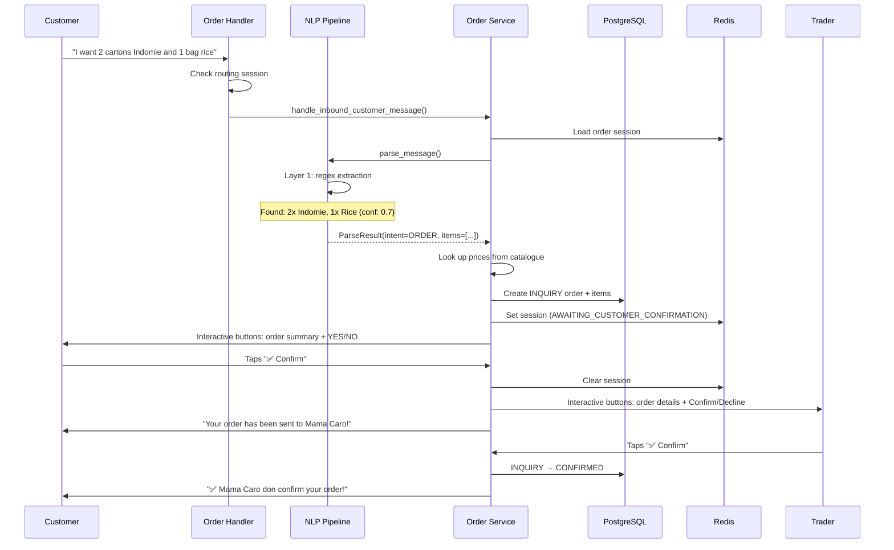
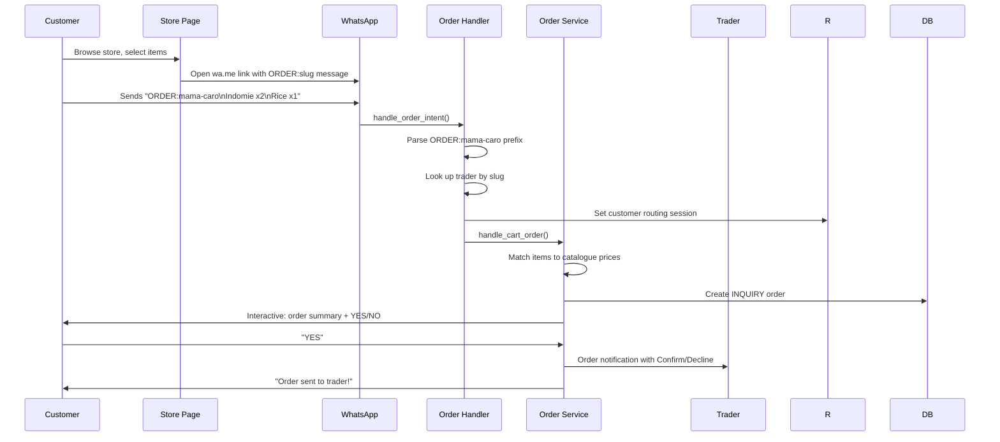
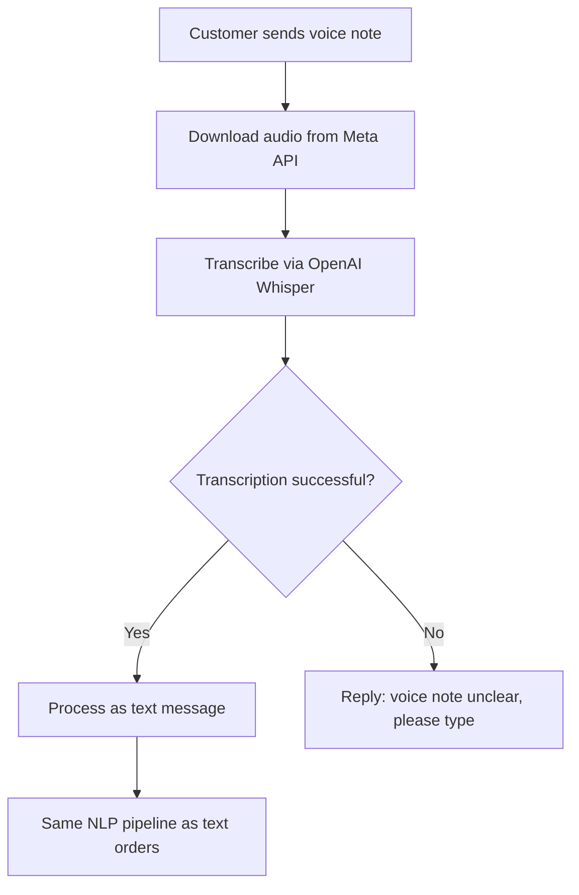
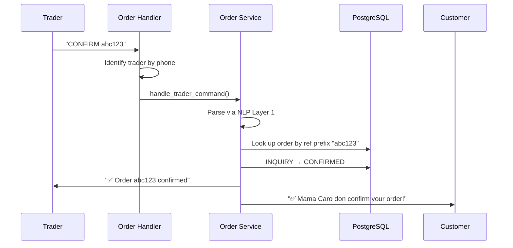
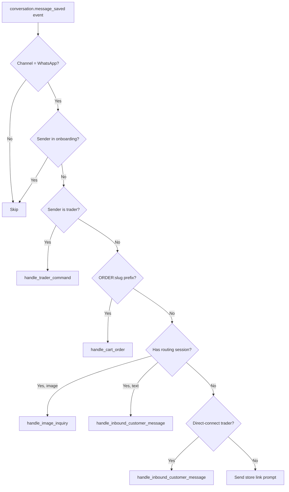
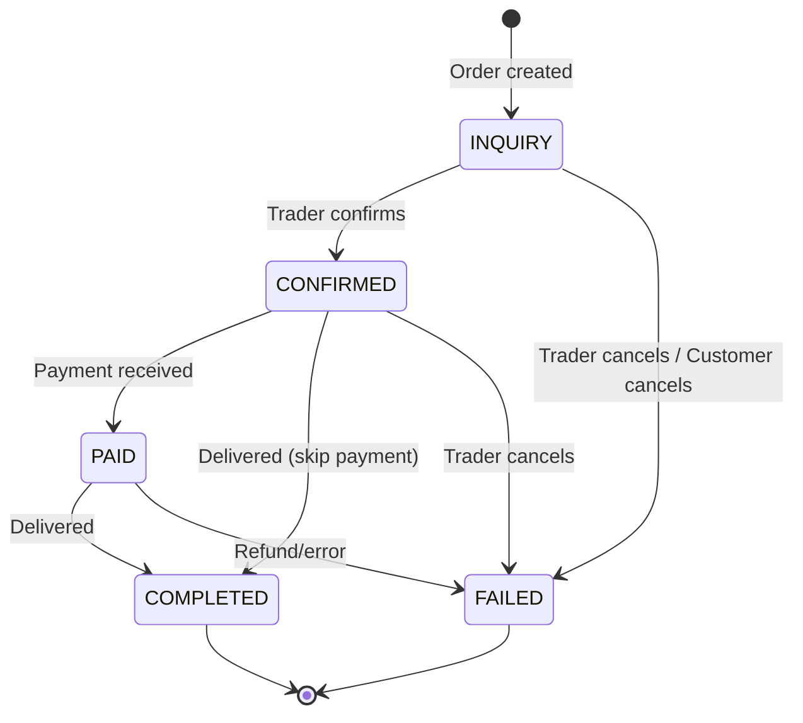
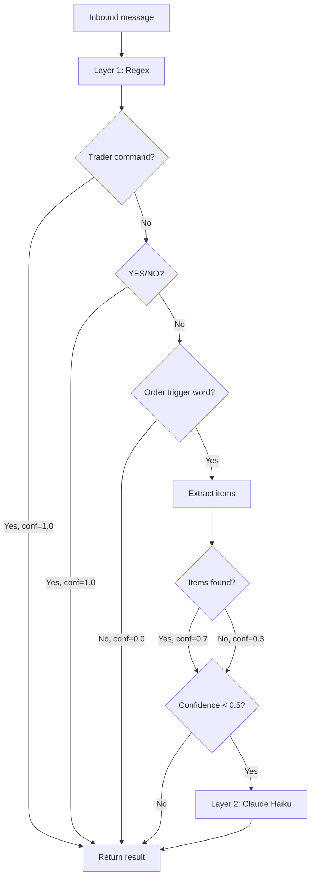

# Feature 2: Intelligent Order Management

## Technical Design Document

**Version:** 1.0
**Last Updated:** 2026-05-04
**Status:** Production

---

## 1. Overview

### Purpose
Intelligent Order Management captures customer orders from messy WhatsApp messages — text, voice notes, images, and structured cart submissions — parses them using a 2-layer NLP pipeline, manages the order lifecycle through a state machine, and coordinates between customers and traders via interactive WhatsApp messages.

### Business Value
- Traders don't need to manually track orders — the system does it
- Customers order naturally in Pidgin English, Yoruba, or structured messages
- 80% of messages parsed by fast regex rules (<5ms), Claude Haiku only for ambiguous cases
- Interactive buttons eliminate typo errors in confirmations

### Target Users
- **Customers:** People ordering from traders via WhatsApp or the store page
- **Traders:** Store owners who confirm/cancel/manage orders via WhatsApp commands
- **System:** Automated state transitions, notifications, and learning

---

## 2. System Context

### Architecture Position

```
Customer WhatsApp Message
       │
       ▼
POST /webhooks/whatsapp
       │
       ▼
Event Bus: conversation.message_saved
       │
       ▼
Order Handler (handlers.py)
  ├── Is sender a trader? → handle_trader_command()
  ├── Is it ORDER:{slug}? → handle_cart_order()
  ├── Has routing session? → handle_inbound_customer_message() or handle_image_inquiry()
  ├── Direct-connect?     → handle_inbound_customer_message()
  └── Unknown             → "Visit store link" prompt
```

### Dependencies

| Dependency | Purpose | Required |
|-----------|---------|----------|
| Meta WhatsApp Business API | Message send/receive, media download, interactive messages | Yes |
| Anthropic Claude Haiku | Layer 2 NLP for ambiguous messages | Only for ambiguous messages |
| Redis | Order sessions, trader cache, customer routing, pending inquiries | Yes |
| PostgreSQL | Orders, OrderItems, Conversations, Notifications | Yes |

### Key Files

| File | Responsibility |
|------|---------------|
| `app/modules/orders/service.py` | All order business logic, WhatsApp flows |
| `app/modules/orders/handlers.py` | Event routing, trader identity resolution |
| `app/modules/orders/models.py` | Order, OrderItem ORM models |
| `app/modules/orders/nlp.py` | 2-layer NLP pipeline |
| `app/modules/orders/session.py` | Redis sessions and caches |
| `app/modules/orders/state_machine.py` | Valid state transitions |
| `app/modules/orders/whatsapp.py` | Nigerian English message templates |
| `app/modules/orders/repository.py` | Database operations |
| `app/modules/orders/schemas.py` | Pydantic request/response models |
| `app/modules/notifications/service.py` | WhatsApp message dispatch |

---

## 3. Entry Points

### 3.1 WhatsApp Direct Message (Customer → Platform Number)
- Customer sends a text/voice/image message to the platform WhatsApp number
- Routed based on customer routing session or trader context

### 3.2 Store Cart (Web → WhatsApp)
- Customer browses the store page at `https://chattosales.com/stores/{slug}`
- Selects products, taps "Order on WhatsApp"
- Opens WhatsApp with pre-formatted message: `ORDER:{slug}\nProduct x2\nProduct x1`
- Parsed by the order handler as a structured cart order

### 3.3 WhatsApp Trader Command
- Trader sends commands like `CONFIRM abc123`, `CANCEL abc123`, `PAID abc123`, `DELIVERED abc123`
- Identified by matching sender phone to a completed Trader record

### 3.4 WhatsApp Interactive Button/List Reply
- Customer taps interactive buttons (YES/NO, Confirm/Decline)
- Customer selects from list picker (quantity selection)
- Button/list `id` becomes the message content for processing

### 3.5 Dashboard REST API
- `POST /api/v1/orders` — create order manually
- `GET /api/v1/orders` — list orders (tenant-scoped, superadmin sees all)
- `GET /api/v1/orders/{id}` — get single order
- `POST /api/v1/orders/{id}/confirm` — state transition
- `POST /api/v1/orders/{id}/pay`
- `POST /api/v1/orders/{id}/complete`
- `POST /api/v1/orders/{id}/fail`
- `POST /api/v1/orders/{id}/items` — add line items

---

## 4. End-to-End Flows

### 4.1 Customer Direct Message Flow (Text)



### 4.2 Customer Cart Order Flow (From Store Page)



**Cart Message Format:**
```
ORDER:mama-caro-provisions
Garri x2
Rice x1
Peak Milk x3
```

**Parsing Regex:**
```python
_ORDER_PREFIX_RE = r"^ORDER:([A-Za-z0-9_-]+)"  # Extracts slug
_CART_ITEM_RE = r"^(.+?)\s+[xX](\d+)\s*$"      # Extracts "name xQty"
```

### 4.3 Voice Note Order Flow



**Audio Transcription:** Uses the same Whisper setup as onboarding (same prompt, same MIME type mapping).

### 4.4 Image Inquiry Flow

Covered in detail in Feature 3 (Self-Building Product Catalogue). In the order management context:
1. Customer sends product photo
2. System identifies product (via pHash or Claude Vision)
3. Customer selects quantity via list picker
4. Order created and sent to trader for confirmation

### 4.5 Trader Command Flow



**Trader Commands:**

| Command | Transition | Notification |
|---------|-----------|-------------|
| `CONFIRM {ref}` | INQUIRY → CONFIRMED | Customer: "order confirmed" |
| `CANCEL {ref}` | INQUIRY/CONFIRMED → FAILED | Customer: "order cancelled" |
| `PAID {ref}` | CONFIRMED → PAID | — |
| `DELIVERED {ref}` | PAID → COMPLETED | — |

**Ref Format:** First 8 hex characters of the order UUID (e.g., `3f8a2c1b`)

**Command Regex:**
```python
_TRADER_CMD_RE = r"^(confirm|cancel|paid|deliver(?:ed)?)\s+([a-f0-9]{6,16})\b"
```

**Interactive Button Alternative:**
Trader can also tap Confirm/Decline buttons from the order notification (buttons carry the full command in their `id` field).

### 4.6 Quantity Selection Flow (Image Orders)

When a product is identified from an image, the customer sees a WhatsApp list picker:

```
This look like *Smartphone* from *ola-stores*! 📸

Price: N10,000 each

Select quantity below, or type how many you want (e.g. I want 7).

[📋 Select quantity]
```

**List Picker Options:**

| ID | Title | Description |
|----|-------|-------------|
| `QTY_1` | Buy 1 | N10,000 |
| `QTY_2` | Buy 2 | 2 × N10,000 = N20,000 |
| `QTY_3` | Buy 3 | 3 × N10,000 = N30,000 |
| `QTY_4` | Buy 4 | 4 × N10,000 = N40,000 |
| `QTY_5` | Buy 5 | 5 × N10,000 = N50,000 |
| `NO` | Cancel order | Not what I'm looking for |

**Quantity Input Methods (all work):**

| Input | Method | Qty |
|-------|--------|-----|
| Tap "Buy 3" | List picker | 3 |
| Type "7" | Digit regex | 7 |
| Type "I want 7" | Digit regex | 7 |
| Type "three" | `_WORD_TO_NUM` lookup | 3 |
| Type "meji" | `_WORD_TO_NUM` (Yoruba) | 2 |
| Type "YES" | NLP CONFIRM | Keep existing qty |
| Type "NO" | NLP CANCEL | Cancel order |

**Quantity Handler Logic (in `handle_inbound_customer_message`):**
1. Check for `QTY_` prefix (list tap)
2. If not, check for digit in message via `\b(\d+)\b` regex (1-1000 range)
3. If not, check for word number via `_WORD_TO_NUM` dictionary
4. If quantity found: update order items + amount, set `message = "YES"`, fall through to CONFIRM logic
5. If no quantity found: pass to NLP as normal

---

## 5. Flow Diagrams

### 5.1 Order Handler Routing



### 5.2 Order State Machine



### 5.3 NLP Pipeline



---

## 6. Data Models & Entities

### Order Model

**Table:** `orders`

| Column | Type | Nullable | Default | Description |
|--------|------|----------|---------|-------------|
| `id` | String(36) | No | UUID v4 | Primary key |
| `tenant_id` | String(36) | No | — | Owning tenant |
| `conversation_id` | String(36) | No | — | FK to conversations |
| `customer_id` | String(36) | Yes | — | Optional customer UUID |
| `customer_phone` | String(20) | Yes | — | E.164, for trader notifications |
| `trader_phone` | String(20) | Yes | — | E.164, for tenant migration |
| `state` | String(20) | No | `inquiry` | OrderState enum |
| `amount` | Decimal(12,2) | Yes | — | Total amount (Naira) |
| `currency` | String(3) | No | `NGN` | ISO 4217 |
| `created_at` | DateTime(tz) | No | `now()` | — |
| `updated_at` | DateTime(tz) | No | `now()` | — |

### OrderItem Model

**Table:** `order_items`

| Column | Type | Nullable | Description |
|--------|------|----------|-------------|
| `id` | String(36) | No | UUID v4, PK |
| `order_id` | String(36) | No | FK to orders (CASCADE delete) |
| `product_name` | String(255) | No | — |
| `quantity` | Integer | No | Default 1 |
| `unit_price` | Decimal(12,2) | No | — |

### Relationships
- `Order.items` → `OrderItem[]` (selectin-loaded)
- `Order.conversation_id` → `Conversation.id`

---

## 7. API Contracts

### List Orders

```
GET /api/v1/orders?state=inquiry&from_date=2026-05-01&to_date=2026-05-04&limit=20&offset=0

Headers: Authorization: Bearer {JWT}

Response 200:
{
  "orders": [
    {
      "id": "3f8a2c1b-...",
      "state": "inquiry",
      "amount": "8500.00",
      "currency": "NGN",
      "customer_phone": "2348012345678",
      "items": [
        {"product_name": "Indomie Carton", "quantity": 2, "unit_price": "4250.00"}
      ],
      "item_count": 1,
      "created_at": "2026-05-04T12:00:00Z"
    }
  ],
  "total": 45
}
```

**Superadmin:** When `is_superadmin=True` in JWT, tenant filter is omitted — returns all orders across all tenants.

### Create Order

```
POST /api/v1/orders
Headers: Authorization: Bearer {JWT}

Body:
{
  "conversation_id": "uuid",
  "customer_id": "uuid" (optional),
  "items": [
    {"name": "Indomie Carton", "quantity": 2, "unit_price": 4250}
  ],
  "currency": "NGN"
}

Response 201: OrderOut
```

### State Transitions

```
POST /api/v1/orders/{id}/confirm → 200 OrderOut
POST /api/v1/orders/{id}/pay     → 200 OrderOut
POST /api/v1/orders/{id}/complete → 200 OrderOut
POST /api/v1/orders/{id}/fail    → 200 OrderOut

Error 409: Invalid state transition
Error 404: Order not found
```

---

## 8. State Management

### Order States

| State | Terminal | Description |
|-------|---------|-------------|
| `INQUIRY` | No | Customer expressed intent, awaiting confirmation |
| `CONFIRMED` | No | Trader accepted the order |
| `PAID` | No | Payment received |
| `COMPLETED` | Yes | Fulfilled/delivered |
| `FAILED` | Yes | Cancelled or error |

### Valid Transitions

```python
VALID_TRANSITIONS = {
    "inquiry":   {"confirmed", "failed"},
    "confirmed": {"paid", "completed", "failed"},
    "paid":      {"completed", "failed"},
    "completed": set(),  # terminal
    "failed":    set(),  # terminal
}
```

### Redis Session States

| Session State | Meaning | Expected Next Input |
|--------------|---------|-------------------|
| `AWAITING_CUSTOMER_CONFIRMATION` | Order summary shown, waiting for YES/NO/qty | Button tap, list selection, typed qty, YES, NO |
| `AWAITING_CLARIFICATION` | Ambiguous message, asked clarifying question | Free text response |

---

## 9. Edge Cases & Failure Handling

### Duplicate Messages
- **Webhook deduplication:** `external_id` (WhatsApp message ID) checked on conversation insert — duplicates silently dropped
- **Notification deduplication:** `event_id` as idempotency key — same event never produces two sends

### Order Not Found
- Trader types `CONFIRM xyz` but ref doesn't match → "I no fit find order with ref xyz. Check the exact ref code."

### Invalid State Transition
- Trader tries `CONFIRM` on already-confirmed order → `ConflictError` → "Cannot confirm order {ref}: already confirmed"

### Session Expiry
- Customer order session: 24h TTL
- Customer routing session: 4h TTL
- If expired, customer's next message treated as new interaction

### Missing Prices
- Customer orders item not in catalogue → "I see these items but I no have their prices: {list}. Abeg type the prices."

### Concurrent Orders
- Each customer has one active order session per tenant (Redis key: `order:session:{tenant_id}:{phone}`)
- New order request while session exists → re-prompts for current order confirmation

### Network Failures
- All outbound WhatsApp sends wrapped in try/except with error swallowing
- Failed sends logged at ERROR level but never crash the handler loop
- Notification records marked as FAILED in database

---

## 10. Security Considerations

### Authentication
- **WhatsApp webhook:** HMAC-SHA256 signature verification
- **Dashboard API:** JWT Bearer token with tenant_id claim
- **Superadmin:** `is_superadmin` claim in JWT for cross-tenant access

### Authorization
- Orders scoped by `tenant_id` — traders can only see their own orders
- Trader commands validated by phone number match
- Superadmin bypasses tenant filter for read operations only

### Data Validation
- Order amounts validated as positive decimals
- State transitions enforced by state machine (no direct state assignment)
- Customer phone numbers stored in E.164 format
- Product names capped at 255 characters

---

## 11. Scalability & Performance

### Expected Load
- 1,000 orders/day at scale
- ~3 messages per order (customer request, confirmation, trader notification)
- 80% parsed by Layer 1 regex (<5ms)
- 20% need Claude Haiku (~1-2s)

### Bottlenecks
- Claude Haiku API calls (Layer 2) — batched per message, not per item
- WhatsApp Cloud API rate limits (80 messages/second per phone number)
- PostgreSQL order creation under high concurrency

### Optimizations
- Layer 1 regex handles 80% of messages without any API call
- Trader identity cached in Redis (1h TTL) — avoids DB lookup per message
- Customer routing sessions cached in Redis (4h TTL)
- Interactive buttons reduce ambiguity — fewer clarification round-trips

---

## 12. Observability

### Key Log Patterns
```
INFO  "Order handler: trader command sender={phone} tenant={tid}"
INFO  "Order handler: cart order sender={phone} slug={slug}"
INFO  "NLP Layer 1: intent=order items=2 confidence=0.7"
INFO  "Order created order_id={id} tenant={tid} conversation={cid}"
INFO  "Trader confirmed order_id={id} ref={ref}"
INFO  "WhatsApp sent → {phone} via phone_number_id={pid}"
ERROR "WhatsApp API error status=401 body=... recipient={phone}"
```

### Metrics to Monitor
- Orders created per hour
- NLP Layer 1 vs Layer 2 usage ratio
- Average order completion time (INQUIRY → CONFIRMED)
- Trader response time (notification → CONFIRM)
- WhatsApp API error rate

---

## 13. Assumptions & Limitations

### Assumptions
- One platform WhatsApp number shared by all traders (Phase 1)
- Customers reach the correct trader via store links (ORDER:{slug}) or routing sessions
- Traders respond to order notifications within 24 hours
- Prices are in Nigerian Naira (NGN)

### Limitations
- **No group orders:** Group order collection is deferred (not built)
- **Single currency:** NGN only
- **No payment processing:** PAID state is manually set by trader command (Paystack integration is Feature 6)
- **No order editing:** Once created, items cannot be modified — must cancel and re-order
- **Trader must use commands:** No dashboard-based order management for confirming orders (dashboard is read-only for orders)
- **Voice notes:** Transcription quality depends on audio clarity and accent
