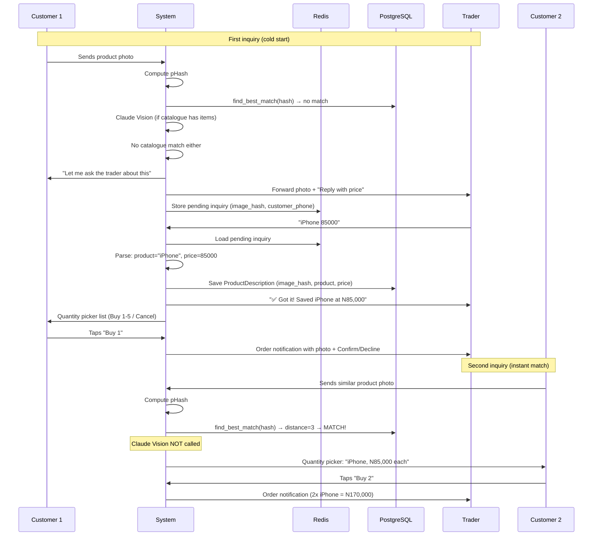
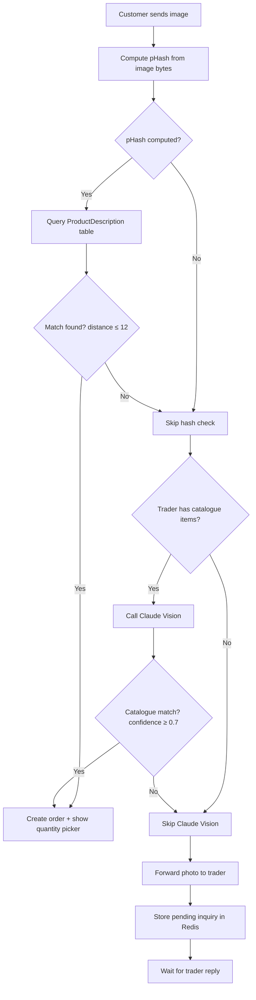
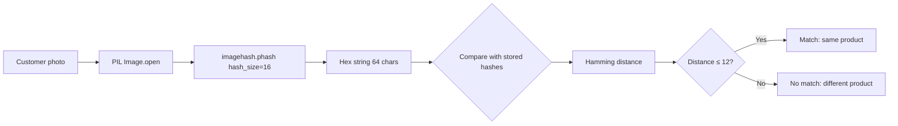
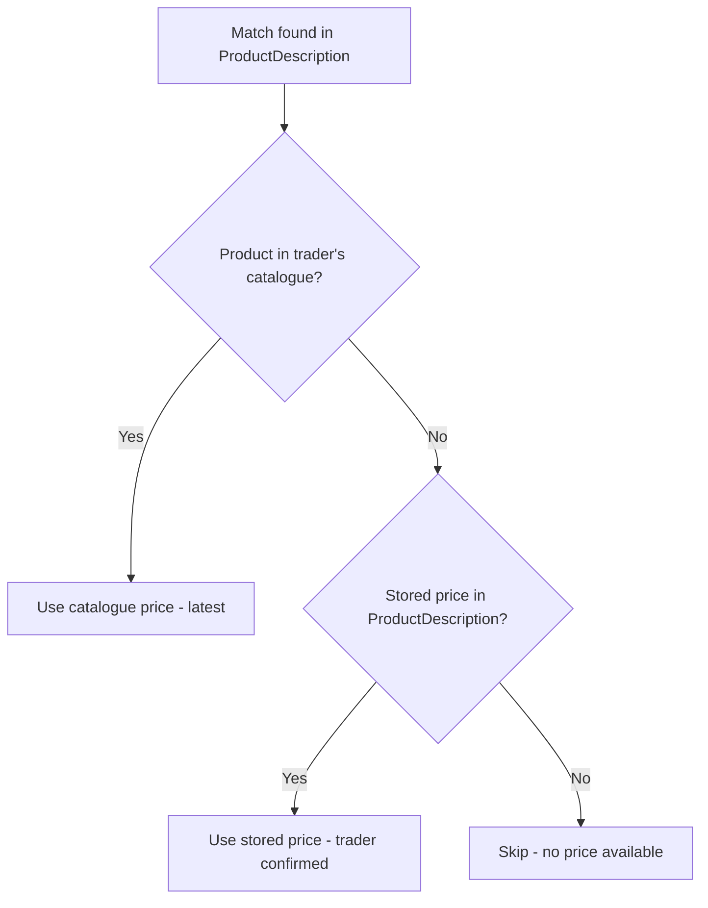
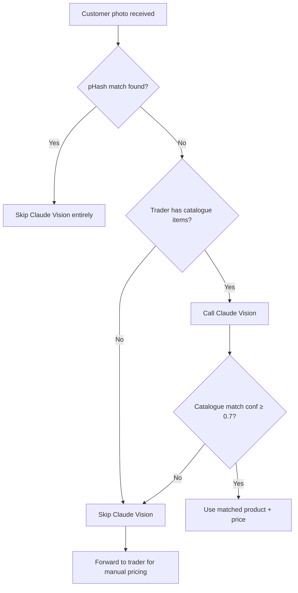

# Feature 3: Self-Building Product Catalogue

## Technical Design Document

**Version:** 1.0
**Last Updated:** 2026-05-04
**Status:** Production

---

## 1. Overview

### Purpose
The Self-Building Product Catalogue allows a trader's product database to grow organically without manual data entry. The catalogue starts with items from onboarding (OCR, voice, Q&A, or empty) and passively learns new products from customer photo inquiries. When a customer sends a product photo that the system hasn't seen before, it forwards the image to the trader. The trader replies with the product name and price, and the system remembers — next time any customer sends a photo of the same product, the system answers automatically.

### Business Value
- **Zero maintenance:** Traders never need to manually update their catalogue
- **Learning from demand:** Only products customers actually ask about get catalogued (high-value items first)
- **Instant recognition:** Second and subsequent inquiries for the same product are resolved in milliseconds with zero API cost
- **Progressive accuracy:** The more customers interact, the smarter the catalogue becomes

### Target Users
- **Traders:** Benefit from automatic catalogue growth without any effort
- **Customers:** Get instant product identification and pricing after the first inquiry
- **System:** Learns product ↔ image associations autonomously

---

## 2. System Context

### Architecture Position

The catalogue system spans two features:
1. **Initial population** during onboarding (Feature 1)
2. **Passive growth** from customer interactions (this feature)

```
Catalogue Sources
  │
  ├── Onboarding (one-time)
  │   ├── Path A: Photo OCR → Google Vision → Claude → products
  │   ├── Path B: Voice → Whisper → Claude → products
  │   ├── Path C: Q&A → manual price entry → products
  │   └── Path D: Skip → empty (learns from orders)
  │
  └── Passive Learning (ongoing)
      └── Customer sends photo → pHash → no match →
          forward to trader → trader replies with price →
          save pHash + product + price →
          next time → instant match (no API call)
```

### Dependencies

| Dependency | Purpose | Required |
|-----------|---------|----------|
| imagehash (Python) | Perceptual image hashing | Yes |
| Pillow (Python) | Image loading and resize | Yes |
| Anthropic Claude Haiku (Vision) | Catalogue matching when catalogue has items | Only if catalogue has items |
| Google Vision API | OCR during onboarding (Path A) | Path A only |
| OpenAI Whisper | Transcription during onboarding (Path B) | Path B only |
| Redis | Pending image inquiry sessions | Yes |
| PostgreSQL | ProductDescription table, Trader catalogue | Yes |

### Key Files

| File | Responsibility |
|------|---------------|
| `app/modules/onboarding/media.py` | `compute_phash()`, `resize_image_bytes()`, `describe_product_image()`, OCR, Whisper |
| `app/modules/onboarding/catalogue_templates.py` | Pre-loaded product templates per category |
| `app/modules/orders/product_descriptions.py` | `ProductDescription` model + repository (pHash storage and matching) |
| `app/modules/orders/service.py` | `handle_image_inquiry()`, `_handle_image_inquiry_reply()`, `_create_image_order()` |
| `app/modules/orders/session.py` | Pending image inquiry Redis sessions |
| `app/modules/orders/whatsapp.py` | Image inquiry WhatsApp templates |

---

## 3. Entry Points

### 3.1 Onboarding (Initial Catalogue Population)

**Trigger:** Trader completes onboarding (Feature 1)
**Result:** `Trader.onboarding_catalogue` populated with JSON product data

See Feature 1 documentation for complete Path A/B/C/D details.

### 3.2 Customer Photo Inquiry (Passive Learning)

**Trigger:** Customer sends an image message while in a routing session to a specific trader
**Handler:** `handle_image_inquiry()` in `orders/service.py`

### 3.3 Trader Price Reply (Learning Confirmation)

**Trigger:** Trader replies to a forwarded image inquiry with a price
**Handler:** `_handle_image_inquiry_reply()` in `orders/service.py`

### 3.4 Store Cart Order (Implicit Learning)

**Trigger:** Customer orders via `ORDER:{slug}` format
**Result:** Product names used in orders are implicitly part of the trader's active catalogue (no image association, but validates product existence)

---

## 4. End-to-End Flows

### 4.1 Initial Catalogue Building (Onboarding)

#### Pre-loaded Templates

**File:** `app/modules/onboarding/catalogue_templates.py`

Each of the 7 business categories has 30 pre-loaded product names used as prompts during Q&A onboarding:

| Category | Sample Items (of 30) |
|----------|---------------------|
| `provisions` | Indomie Carton, Rice 50kg, Peak Milk, Milo, Bournvita, Golden Morn, Dangote Sugar, Kings Oil, Garri, Semovita... |
| `fabric` | Plain Ankara, Lace fabric, Swiss lace, George fabric, Adire, Kampala, Damask, Guinea brocade... |
| `food` | Jollof rice, Fried rice, Eba, Amala, Egusi soup, Pepper soup, Suya, Shawarma, Pounded yam... |
| `electronics` | Phone charger, Earphones, Power bank, USB cable, Bluetooth speaker, Phone case, Screen protector... |
| `cosmetics` | Fair & White cream, Vaseline, Hair extensions, Lipstick, Foundation, Perfume, Body spray... |
| `building` | Cement, Iron rod, Roofing sheet, Paint, Tiles, POP ceiling, Plumbing pipes, Electrical wire... |
| `other` | (empty list) |

**Function:** `get_items(category: str) → list[str]`
Returns the item name list for the given category, or empty list for unknown categories.

#### Catalogue Storage Format

**Path A/B (OCR/Voice):** JSON array
```json
[
  {"name": "Indomie Carton", "price": 8500},
  {"name": "Rice 50kg", "price": 63000}
]
```

**Path C (Q&A):** JSON dict
```json
{
  "Indomie Carton": 8500,
  "Rice 50kg": 63000
}
```

**Path D (Skip):** `null`

**Storage:** `Trader.onboarding_catalogue` (TEXT column, JSON string)

**Parsing at Runtime:**
```python
def _parse_catalogue(onboarding_catalogue: str | None) -> dict[str, int]:
    """Parse JSON catalogue to {name: price} dict."""
    if isinstance(raw, dict):
        return {str(k): int(v) for k, v in raw.items() if v}
    if isinstance(raw, list):
        return {
            str(item["name"]): int(item["price"])
            for item in raw
            if isinstance(item, dict) and item.get("name") and item.get("price")
        }
    return {}
```

### 4.2 Passive Learning Flow (Complete)



### 4.3 Image Inquiry Flow (Detailed)

**Entry:** `handle_image_inquiry()` in `orders/service.py`



**Step-by-step:**

1. **Compute pHash** (local, ~5ms, no API call)
   ```python
   image_hash = compute_phash(image_bytes)
   ```

2. **Check stored hashes** (DB query, fastest path)
   ```python
   learned = await pd_repo.find_best_match(
       trader_phone=trader_phone,
       new_image_hash=image_hash,
       catalogue=catalogue,
   )
   ```
   If match found → skip to step 5

3. **Claude Vision** (only if catalogue has items)
   ```python
   if catalogue:
       analysis = await describe_product_image(image_bytes, catalogue, category)
   ```
   If `matched_product` with `confidence >= 0.7` → skip to step 5

4. **Forward to trader** (no match found)
   - Send photo + "Customer +234... dey ask about this item. Reply with the product name and price."
   - Store pending inquiry in Redis:
     ```
     Key: image:inquiry:{trader_phone}
     TTL: 24 hours
     Value: {customer_phone, image_hash, tenant_id, conversation_id, channel_tenant_id}
     ```

5. **Show quantity picker** to customer (match found via hash or Claude)
   - WhatsApp list message with Buy 1-5 + Cancel
   - Order created in INQUIRY state

### 4.4 Trader Reply Learning Flow

**Entry:** `_handle_image_inquiry_reply()` in `orders/service.py`

**Trigger:** Trader sends a message that doesn't match any trader command AND a pending image inquiry exists.

**Reply Parsing:**

| Trader Reply | Product Name | Price |
|-------------|-------------|-------|
| `85000` | "Product" (generic) | 85000 |
| `iPhone 85000` | "iPhone" | 85000 |
| `iPhone Case 8,500` | "iPhone Case" | 8500 |
| `5000` | "Product" | 5000 |

**Parsing Algorithm:**
1. Strip non-digit separators from commas: `"8,500"` → `"8500"`
2. Find all numbers in cleaned text
3. Last number = price
4. Text before the price = product name
5. If no text before price → product name = "Product" (generic fallback)
6. If product name matches a catalogue item (fuzzy) → use the catalogue name

**What gets saved:**
```python
await pd_repo.save(
    trader_phone=trader_phone,
    product_name=product_name,
    price=price,
    image_hash=pending_image_hash,
    confirmed=True,
)
```

**After saving:**
- Notify trader: "✅ Got it! I don save *{product}* at N{price}. Next time a customer send photo of this product, I go answer them automatically."
- Create order for the customer → show quantity picker
- Clear pending inquiry from Redis

---

## 5. Flow Diagrams

### 5.1 Perceptual Hash Matching



### 5.2 Price Resolution



### 5.3 Claude Vision Decision



---

## 6. Data Models & Entities

### ProductDescription Model

**Table:** `product_descriptions`

| Column | Type | Nullable | Default | Description |
|--------|------|----------|---------|-------------|
| `id` | String(36) | No | UUID v4 | Primary key |
| `trader_phone` | String(20) | No | — | E.164, indexed |
| `product_name` | String(255) | No | — | Confirmed product name |
| `price` | Integer | Yes | — | Naira, trader-confirmed |
| `description` | Text | Yes | — | Claude Vision text (if available) |
| `image_hash` | String(64) | Yes | — | Hex pHash for matching |
| `confirmed` | Boolean | No | `false` | True after trader confirms |
| `created_at` | DateTime(tz) | No | `now()` | — |
| `updated_at` | DateTime(tz) | No | `now()` | — |

**Indices:**
- `ix_product_desc_trader_phone` on `trader_phone`
- `ix_product_desc_trader_product` on `(trader_phone, product_name)`

### Redis: Pending Image Inquiry

**Key:** `image:inquiry:{trader_phone}`
**TTL:** 24 hours

**Value:**
```json
{
  "customer_phone": "2348012345678",
  "image_hash": "a1b2c3d4e5f6...",
  "tenant_id": "uuid",
  "conversation_id": "uuid",
  "channel_tenant_id": "tenant-abc-123"
}
```

### Redis: Order Session (with media_id)

When an order is created from an image match, the session includes the `media_id` so the trader notification can include the customer's photo:

```json
{
  "state": "awaiting_customer_confirmation",
  "order_id": "uuid",
  "items": [{"name": "iPhone", "qty": 1, "unit_price": 85000}],
  "total": 85000,
  "media_id": "whatsapp-media-id-123"
}
```

---

## 7. API Contracts

### Perceptual Hash Functions

```python
def compute_phash(image_bytes: bytes) -> str:
    """
    Input:  Raw image bytes (any format PIL can open)
    Output: Hex string (64 chars for hash_size=16)
    Cost:   ~5ms, no API call
    """

def phash_hamming_distance(hash_a: str, hash_b: str) -> int:
    """
    Input:  Two hex-encoded pHash strings
    Output: Integer (0 = identical, higher = more different)
    Cost:   <1ms
    """
```

### Image Resize

```python
def resize_image_bytes(image_bytes: bytes, max_dim: int = 768) -> bytes:
    """
    Input:  Raw image bytes
    Output: JPEG bytes, longest side ≤ max_dim, aspect ratio preserved
    Quality: 85
    Cost:   ~10ms, no API call
    """
```

### Claude Vision (Catalogue Matching)

```python
async def describe_product_image(
    image_bytes: bytes,
    catalogue: dict[str, int],
    category: str = "",
) -> dict[str, Any]:
    """
    Input:  Image bytes + trader catalogue + category
    Output: {
        "description": "Canonical product description (≤20 words)",
        "matched_product": "exact catalogue name" or None,
        "matched_price": int or None,
        "confidence": 0.0-1.0
    }
    Cost:   ~$0.00048 per image (Haiku, 768x768)
    Called: Only when catalogue has items AND pHash didn't match
    """
```

### ProductDescription Repository

```python
async def save(
    trader_phone: str,
    product_name: str,
    description: str | None = None,
    price: int | None = None,
    image_hash: str | None = None,
    confirmed: bool = True,
) -> ProductDescription

async def find_best_match(
    trader_phone: str,
    new_image_hash: str,
    catalogue: dict[str, int],
) -> dict | None:
    """
    Returns: {"product_name": str, "price": int, "distance": int}
    or None if no match within threshold (Hamming distance ≤ 12)
    """
```

---

## 8. State Management

### Image Inquiry States

| State | Location | Description |
|-------|---------|-------------|
| Photo received | Order handler | Customer sends image, routed to `handle_image_inquiry` |
| pHash checking | Service | Compute hash, query DB for matches |
| Claude Vision | Service | Called only if no hash match and catalogue has items |
| Forwarded to trader | Redis | `image:inquiry:{trader_phone}` stores pending inquiry |
| Trader replied | Service | `_handle_image_inquiry_reply` processes price |
| Learned | DB | ProductDescription saved with hash + product + price |
| Quantity selection | Redis | Order session `AWAITING_CUSTOMER_CONFIRMATION` with `media_id` |
| Order confirmed | DB + WhatsApp | Customer picked qty, trader notified with photo + buttons |

### Matching Priority

```
1. pHash match (ProductDescription table)    → instant, free
2. Claude Vision catalogue match              → ~1-2s, ~$0.0005
3. Forward to trader                          → depends on trader response time
```

---

## 9. Edge Cases & Failure Handling

### pHash Computation Fails
- **Cause:** Corrupt image, unsupported format
- **Handling:** `image_hash` set to `None`, skip hash matching, proceed to Claude Vision or trader forwarding
- **Logged:** WARNING level

### Claude Vision Fails
- **Cause:** API timeout, rate limit, invalid image
- **Handling:** Caught by try/except, proceeds to forwarding to trader
- **No error shown to customer** — seamlessly falls through to manual path

### Trader Never Replies to Image Inquiry
- **Pending inquiry TTL:** 24 hours in Redis
- **After expiry:** Next image from any customer for this trader starts fresh
- **Customer impact:** "I've asked the trader" message was sent — customer may follow up

### Same Image, Different Traders
- **pHash stored per trader:** `ProductDescription.trader_phone` scopes the lookup
- **Same photo sent to different stores:** Each trader's catalogue learns independently
- **No cross-trader leakage**

### Product Price Changes
- **Price resolution order:**
  1. Current catalogue price (latest)
  2. Stored price in ProductDescription (fallback)
- **If trader updates their catalogue**, the new price is used even for hash-matched products

### Trader Replies with Only a Price (No Product Name)
- **Parsing:** No text before the price → `product_name = "Product"` (generic)
- **Effect:** The image is still learned and will match next time
- **Trader can name it:** "iPhone 85000" next time they encounter it

### Multiple Pending Inquiries
- **Current limitation:** Only ONE pending inquiry per trader phone (Redis key: `image:inquiry:{trader_phone}`)
- **If second customer sends photo while first is pending:** Overwrites the first pending inquiry
- **Mitigation:** Short trader response times expected; 24h TTL as safety net

### WhatsApp Image as Reply to Trader
- When the system identifies a product and creates an order, the trader receives:
  1. **Message 1:** The customer's photo with caption
  2. **Message 2:** Interactive order buttons, sent as a **reply** to the photo (uses `context.message_id`)
- **If wamid extraction fails:** Interactive buttons sent without reply context (still works, just no visual link)

---

## 10. Security Considerations

### Data Isolation
- ProductDescriptions scoped by `trader_phone` — no cross-trader queries
- Image hashes are opaque hex strings — cannot reverse to reconstruct the image
- No customer images stored — only the perceptual hash (a fingerprint, not the image itself)

### API Key Protection
- Claude Vision API key in environment variable, never logged
- Google Vision API key passed as query parameter (HTTPS encrypted)
- OpenAI API key in environment variable

### Input Validation
- Image bytes validated by PIL (corrupt images raise exception, caught gracefully)
- Trader price replies validated: must contain a number, 1-1000000 range
- Product names capped at 255 characters (DB constraint)

---

## 11. Scalability & Performance

### Cost Analysis per Image Inquiry

| Path | API Calls | Cost | Time |
|------|----------|------|------|
| pHash match (returning product) | 0 | Free | ~10ms |
| Claude Vision match (catalogue) | 1 (Claude) | ~$0.0005 | ~1.5s |
| Forward to trader (new product) | 0 | Free | ~50ms (+ trader time) |

### Storage Growth
- Each ProductDescription: ~500 bytes (including 64-char hash)
- 100 products per trader × 10,000 traders = 1M rows = ~500MB
- Acceptable for PostgreSQL without special optimization

### Performance Characteristics
- pHash computation: ~5ms (CPU-bound, no I/O)
- Image resize: ~10ms (CPU-bound)
- Hash comparison: O(n) where n = confirmed descriptions per trader
- Expected n < 100 per trader → <1ms for full scan

### Optimization Path (Future)
- If n grows large: add PostgreSQL index on `image_hash` for prefix matching
- Or: use pgvector extension for approximate nearest neighbor search
- Current approach (full scan) is sufficient for Phase 1 scale

---

## 12. Observability

### Key Log Patterns

```
# pHash match (instant)
INFO  "Image hash match: product=iPhone distance=3 customer=2348012345678"

# Claude Vision match
INFO  "Claude Vision: description='...' matched=Rice 50kg confidence=0.85"

# Forwarded to trader
INFO  "Image inquiry forwarded to trader=2349012345678 customer=2348012345678"

# Trader reply learned
INFO  "Image inquiry learned: trader=2349012345678 product=iPhone price=85000"
INFO  "ProductDescription saved id=uuid trader=2349012345678 product=iPhone has_hash=True"

# pHash computation failure
WARNING "pHash computation failed sender=2348012345678: PIL.UnidentifiedImageError"

# Claude Vision skipped (no catalogue)
DEBUG  "Skipping Claude Vision — catalogue empty"
```

### Metrics to Monitor
- pHash match rate (% of image inquiries resolved without API call)
- Claude Vision match rate (% resolved via catalogue matching)
- Trader response time to forwarded inquiries
- ProductDescription table growth rate per trader
- Average Hamming distance of successful matches

---

## 13. Assumptions & Limitations

### Assumptions
- Product photos are reasonably clear (not extremely dark or blurry)
- The same product type looks visually similar when photographed differently (true for most market goods)
- Traders respond to image inquiries within 24 hours
- A Hamming distance threshold of 12 (out of 256 bits for hash_size=16) provides sufficient discrimination

### Limitations
- **No image storage:** Only the hash is stored — the original image is not retrievable
- **pHash limitations:** Perceptual hashing works well for the same object from different angles/backgrounds, but may struggle with:
  - Very different product variants (e.g., different iPhone models)
  - Products that look identical but are different (e.g., different brands of white rice in identical bags)
  - Extremely dark or overexposed photos
- **One pending inquiry per trader:** If two customers send photos simultaneously, only the last pending inquiry is preserved
- **Claude Vision required for catalogue matching:** There's no non-LLM way to match a photo against text product names
- **Catalogue not synced back:** Learned products via image inquiry are stored in ProductDescription table, NOT written back to `Trader.onboarding_catalogue`. They exist in parallel.
- **No deduplication:** If the same product is confirmed by the trader multiple times from different photos, multiple ProductDescription rows are created (but matching works — any hash match returns the product)
